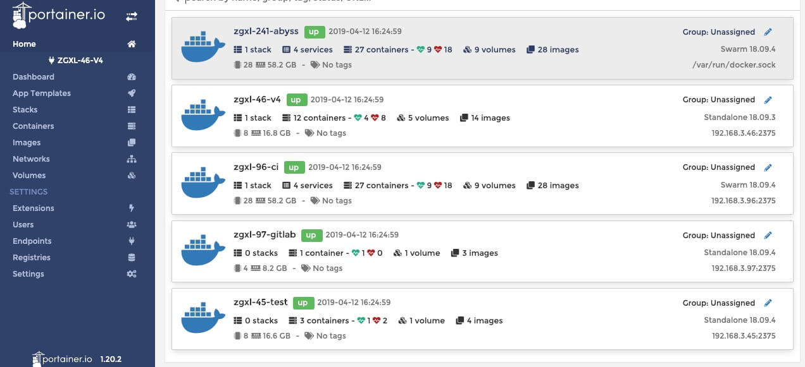
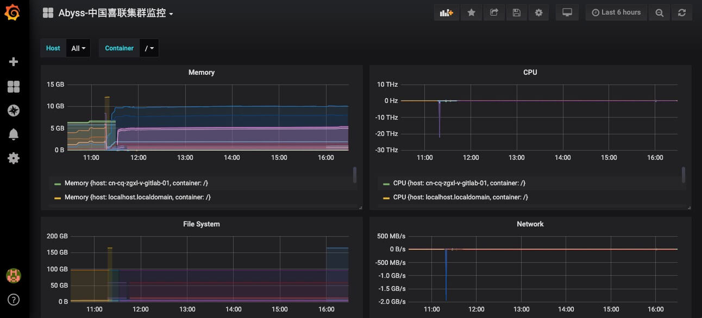

# monitor 

    日志和性能监控, 在运维中至关重要！
    swarm是一种docker自带的, 兼顾性能和可靠性的一群集群方式。
    旨在花费最少的代价, 创建可靠的监控集群以提供可视化分析。
    通过监控集群的建立, 积累集群运维经验, 为搭建测试服务器集群做准备。

- influxdb 时序数据库, 方便记录时间维度的数据, 对于性能监控很擅长。
- grafana 开源可视化框架, 支持多种数据源mysql,es,influxdb,graghite。-
- cadvisor 谷歌的节点监控器, 用于收集节点数据。
- portainer docker管理UI界面, 简化docker管理操作。
    
[toc]

## 面板

- [Docker管理面板](192.168.3.96:9000)

- [Grafana可视化面板](192.168.3.96:3000)

## 方案进度

- [ ] 高可用 - 分布式持久化数据
- [ ] 高可用 - 数据备份、回滚方案
- [ ] 高可用 - swarm: 滚动升级
- [ ] 易用性 - ansible: 批量运维操作
- [ ] 安全性 - traefik: https/与反向代理
- [ ] 功能性 - grafana: influxdb与集群性能监控
- [ ] 功能性 - grafana: 集群监控报警
- [ ] 功能性 - grafana: es与集群日志收集/分析
- [ ] 功能性 - grafana: jmeter/es与压力测试可视化
- [ ] 功能性 - grafana: mysql与日志分析
- [ ] 功能性 - grafana: kong与nginx日志分析
- [ ] 高可用 - docker: 私有仓库
- [ ] 功能性 - nexus3: maven私有仓库

## 集群概述
#### service

- [x] **docker**: [node]   2375,2377,443,22,9323
- [x] **influxdb**: [manager]  8086,8083
- [x] **grafana**: [manager]    3000
- [x] **cadvisor**: [node]  19998
- [x] **portainer**: [manager] 9000

### Node
#### Manager

- zgxl-96-ci    192.168.3.96

#### Worker

- zgxl-97-gitlab    192.168.3.97
- zgxl-45-test  192.168.3.45
- zgxl-46-v4    192.168.3.46

#### enviroment

- kernel 3.10.0-514.el7.x86_64
- pretty hostname
- static ip
- TZ Asia/Shanghai
- sshd remote
- python 2.7.5
- pip 8.1.2
- docker 18.09.3
- docker-compose 1.24.0
- git 1.8.3.1