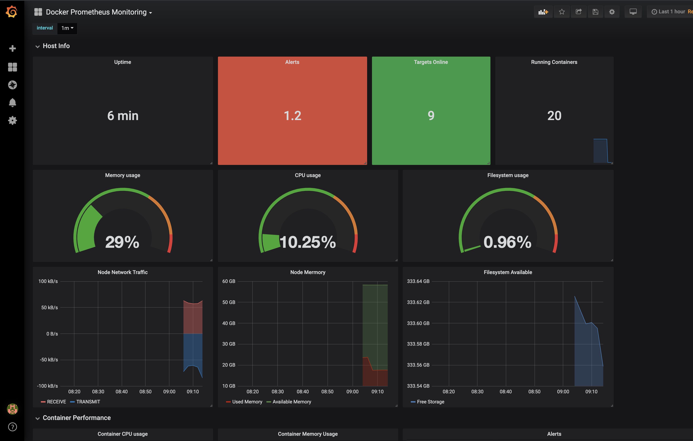

# zgxl-monitor 

日志和性能监控, 在运维中至关重要！
旨在花费最少的代价, 创建可靠的监控集群以提供可视化分析。
通过监控集群的建立, 积累集群运维经验, 为搭建测试服务器集群做准备。

有关集群节点分布情况, 请看[zgxl-swarm](http://183.64.28.18:8686/automatic/zgxl-swarm)

[toc]

## 面板
- [Portainer集群管理](192.168.3.96:19000)

- [Grafana可视化面板](192.168.3.96:3000)

## 功能

- [x] 功能性 - registry: Docker私有仓库
- [x] 功能性 - grafana: 集群基础性能监控
- [x] 功能性 - teamcity: TeamCity持续交付
- [ ] 功能性 - grafana: 集群监控报警
- [ ] 功能性 - grafana: es与集群日志收集/分析
- [ ] 功能性 - grafana: jmeter/es与压力测试可视化
- [ ] 功能性 - grafana: mysql与日志分析
- [ ] 功能性 - grafana: kong与nginx日志分析
- [ ] 功能性 - nexus3: maven私有仓库

## 集群概述
#### 服务
- [x] [docker](#docker概述): [node]   2375,2377,443,22,9323
- [x] [grafana](#grafana概述): [manager]    3000
- [x] [cadvisor](#cadvisor概述): [node]  19998
- [x] [node-exporter](#node-exporter概述): [node]  19997
- [x] [portainer](#portainer概述): [manager] 19000
- [x] [prometheus](#prometheus概述): [manager] 9090
- [x] [alertmanager](#alertmanager概述): [manager] 9093
- [x] [registry](#registry概述): [manager] 5000
- [x] [teamcity](#teamcity概述): [manager] 8111
- [x] [teamcity-agent](#teamcity概述): [manager] 8111
- [ ] [unsee](#alertmanager概述): [manager]

#### 服务概述
##### docker概述
虚拟化和集群的基础
##### influxdb概述
Influxdb 时序数据库, 方便记录时间维度的数据, 对于性能监控很擅长。
##### grafana概述
开源的数据可视化平台, 支持多种数据源mysql,es,influxdb,graghite。
##### cadvisor概述
Cadvisor 谷歌的节点监控器, 用于收集节点数据。
##### node-exporter概述
容器节点监控器, macos不能使用。
##### prometheus概述
开源监控系统。
##### portainer概述
Portainer docker管理UI界面, 简化docker管理操作。
##### registry概述
Docker Registry V2, docker镜像仓库。
##### teamcity
Jetbrains的持续交付系统, 易用性强。虽然不开源只有3个agent, 小团队戳戳有余。